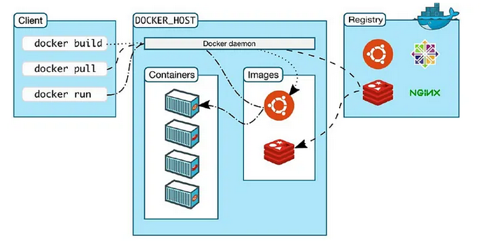
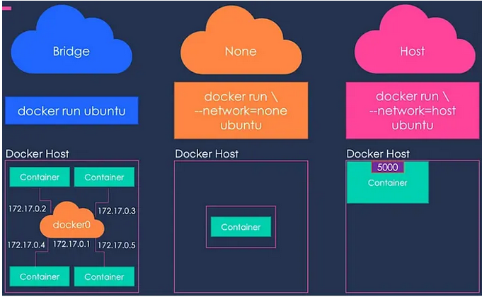

# Docker summary

This is my summary of Docker concepts and commands from following the source : https://medium.com/@CJwrites154/master-docker-the-ultimate-zero-to-hero-guide-for-beginners-part-1-1fc1d0d5d2d4

## Docker components

Docker architecture : Client-server ; the docker client talks to the docker daemon which does the building and running of containers.

Docker daemon : backgroudn service manges containers, images, networks and volumes.

Docker client : command line interface to interact with docker daemon.

Docker images : read-only templates with instructions for creating a docker container.

Docker containers : runnable instances of docker images.

Docker registries : repositories to store and distribute docker images. Docker Hub is a popular public registry.

Docker engine : core software that enables containerization.

## Command examples

- `docker version` : check docker version
- `docker info` : display system-wide information
- `docker pull <image>` : download an image from a registry
- `docker images` : list downloaded images
- `docker run <image>` : create and start a container from an image
- `docker ps` : list running containers
- `docker ps -a` : list all containers (running and stopped)
- `docker stop <container_id>` : stop a running container
- `docker rm <container_id>` : remove a stopped container
- `docker rmi <image_id>` : remove an image

source : https://medium.com/@CJwrites154/master-docker-the-ultimate-zero-to-hero-guide-for-beginners-part-2-4bc1c1989488

# Docker volumes

Docker volumes are used to persist data generated by and used by Docker containers. They are stored outside the container's filesystem, allowing data to persist even when the container is removed. They are also used to share data between multiple containers.

- named volumes : created and managed by Docker, can be reused across containers.
- anonymous volumes : created without a specific name, typically used for temporary data storage.
- host volumes : bind mounts that map a directory on the host machine to a directory in the container.

# Docker networks
This allows docker containes to communicate with each other and with the outside networks.

- Bridge network : default network type for containers on a single host. Provides isolation and allows containers to communicate with each other using IP addresses.
- Host network : removes network isolation between the container and the host. The container shares the host's network stack.
- None network : disables all networking for the container.

source : https://medium.com/@CJwrites154/master-docker-how-to-successfully-deploy-a-3-tier-application-zero-to-hero-guide-part-3-6fa05dadc9c7

Dockerfile is a text file that contains a set of instructions to build a Docker image. It defines the base image, application code, dependencies, environment variables, and commands to run the application.

- FROM : specifies the base image
- RUN : executes commands in the container during the build process
- CMD : specifies the command to run when the container starts
- ENTRYPOINT : sets the main command for the container
- COPY : copies files from the host to the container
- ADD : adds files from the host to the container, similar to COPY but with additional tar extraction and remote URL access.
- WORKDIR : sets the working directory for subsequent instructions (TODO : not understanded well)
- ENV : sets environment variables in the container
- EXPOSE : informs Docker that the container listens on the specified network ports at runtime
- VOLUME : creates a mount point for a volume in the container
- ARG : defines build-time variables that can be passed during the build process